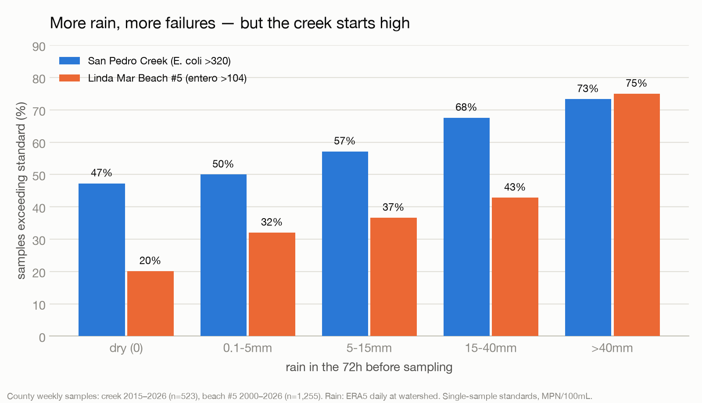
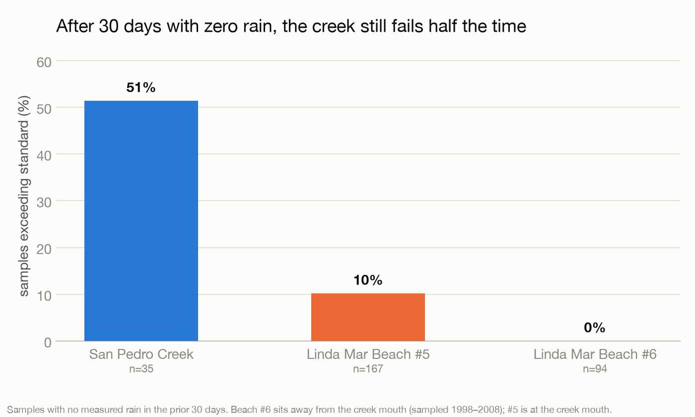
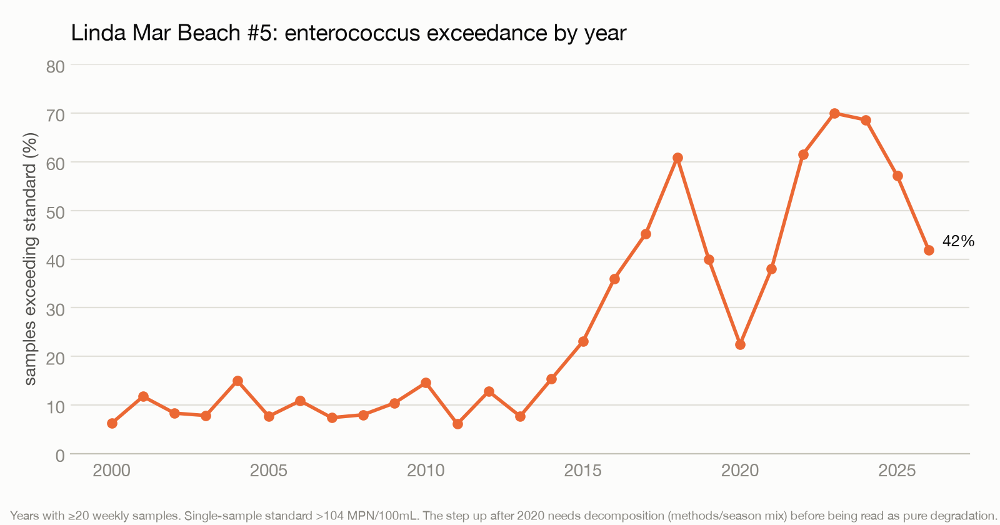

# Findings v1 — rain vs. bacteria at Linda Mar (2026-08-14)

First cross-analysis of 28 years of county sampling against daily rainfall.
Data: CEDEN/BeachWatch via data.ca.gov (county weekly samples, 1998–2026);
ERA5 daily precipitation at the San Pedro Creek watershed (Open-Meteo archive).
Reproduce: `pipeline/fetch.py` → `pipeline/analyze.py` → `pipeline/charts.py`.

## Headline numbers

Stations: **CREEK** = San Pedro Creek at Pacifica State Beach (E. coli, freshwater
STV >320 MPN/100mL), **LM5** = Linda Mar Beach #5 at the creek mouth
(enterococcus, AB411 >104), **LM6** = Linda Mar Beach #6 away from the creek
mouth (enterococcus >104; sampled 1998–2008).

| | overall | 2020+ | dry 72h | >40mm 72h | zero rain 30d |
|---|---|---|---|---|---|
| CREEK (n=523, 2015–) | 50.9% | 42.3% | 47.3% | 73.3% | **51.4%** |
| LM5 (n=1,255, 2000–) | 26.8% | 52.9% | 20.1% | 75.0% | 10.2% |
| LM6 (n=383, 2000–08) | 0.8% | — | 0.4% | 14.3% | 0.0% |

## Three findings

**1. The creek has a persistent dry-weather source.** After 30 consecutive
rain-free days — no runoff, no storm drains flowing — the creek still exceeds
the E. coli standard **51%** of the time (n=35), and its wet-season vs
dry-season rates are statistically indistinguishable (49.8% vs 52.3%). Rain
*amplifies* creek contamination (47% dry → 73% after >40mm) but is not its
cause. This is independently consistent with the Coalition's DNA source-tracking
pointing at human waste from sewer infrastructure: leaking laterals discharge in
all weather. Rain-feature AUC at the creek is weak (~0.56–0.59) precisely
*because* the baseline is so high — you can't predict a coin that mostly lands
dirty.

**2. The beach is rain-driven, and the creek is the vector.** LM5 at the creek
mouth runs 20% on dry days, 10% after a dry month, and 75% after >40mm storms —
a classic runoff-driven response (AUC 0.62 for 72h antecedent rain). The old
LM6 station, a few hundred meters from the creek mouth, almost never exceeded
(0.8% overall, 0% bone-dry) across a decade of sampling. Same beach, same
ocean — the difference is the creek. (Era caveat: LM6 data ends 2008.)

**3. Linda Mar got worse, starting ~2014.** LM5 annual exceedance was flat at
6–15% from 2000–2013, then climbed nearly monotonically to ~70% by 2023
(42% in 2026 to date). The rise predates the 2020 era-boundary in the data,
so it is not an artifact of the dataset split; whether it reflects
infrastructure decay, changed lab methods (Enterolert adoption), sampling-time
changes, or rainfall pattern shifts needs decomposition. The years 2014–2016 —
drought years — rising is itself interesting given the dry-weather signal.

## What this means for a forecast

- A **beach-day forecast for LM5 is viable now**: antecedent rain alone
  separates a 10–20% risk regime from a 75% regime. Adding tide, waves, season,
  and creek state should push a logistic/GBM model into genuinely useful
  territory. This is the surfer-facing product.
- A **creek forecast is the wrong product** — the creek's problem isn't
  weather, it's a source. The creek series' value is evidentiary: the dry-weather
  baseline and the 4-site longitudinal profile (BWTF data, pending) localize
  and quantify the source for advocacy.
- The winter campaign should oversample **storm onsets** (first significant
  rain after dry spells) and keep some **bone-dry** sampling — the contrast
  between those two regimes is the most information-rich comparison for both
  the model and the sewer-infiltration case.

## Caveats (read before quoting)

- **Rain is ERA5 reanalysis** (~9km grid), not a valley gauge — real gauge or
  radar-blend (Stage IV/MRMS) data will sharpen every rain relationship;
  current AUCs are floors, not ceilings.
- **Same-day rain timing is ambiguous** (samples are ~morning; daily rain
  totals are midnight-to-midnight). `prev1`/`prev3` are the trustworthy
  features.
- Duplicate readings per station-date-analyte were collapsed to the **max**
  (conservative toward exceedance).
- The creek is brackish at the mouth; we apply the freshwater E. coli STV as
  the county does. Enterococcus creek data begins only in 2026 (n=4).
- The 2020+ LM5 jump vs. the by-year trend: the trend is real across eras, but
  method/lab changes over 26 years haven't been ruled out for the *level*.
- Zero-rain-30d creek subsample is small (n=35); the flat wet/dry seasonal
  split (n=523) is the more robust dry-weather evidence.
